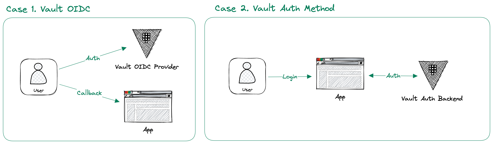

# Vault Auth Backend Test

> OIDC Sample : <https://medium.com/@nitesh_17214/oauth-2-0-authorization-server-using-nodejs-and-expressjs-cf65860fed1e>  
> Code Sample : <https://medium.com/@nitesh_17214/how-to-create-oidc-client-in-nodejs-b8ea779e0c64>  
> Vault OIDC Provider : <https://developer.hashicorp.com/vault/docs/secrets/identity/oidc-provider>



Vault's Auth Method connects various authentication systems as backends for authentication to Vault. An OIDC Provider is provided as a way to utilize these characteristics of Vault in external applications, and it is also possible to utilize the access management system such as Entity and Group of Vault by utilizing Vault authentication itself.

## 1. Vault setup sample

- Run Vault dev mode
  ```
  vault server -dev -dev-root-token-id=root -log-level=trace
  ```

- Provisioning Auth & OIDC Provider
  ```
  $ cd terraform
  $ terraform init
  $ terraform apply

  ...
  Outputs:

  oidc_client_id = "3Ev8oYCDNohMIQhwiKqBq1KN2rknYq64"
  oidc_client_secret = "hvo_secret_QtKTaRSpM3bGXTr0N4eQjmixCQVphz4oSrBmCcU9T6tXpB7sEMEk6uHYjVWGMWIm"
  oidc_config_issuer = "http://127.0.0.1:8200/v1/identity/oidc/provider/test"
  test_user_password = "user1"
  test_user_username = "user1"
  ```
  - `oidc_client_id`, `oidc_client_secret`, and `oidc_config_issuer` are used to configure the OIDC Client in the application.
  - `test_user_password` and `test_user_username` for login test user.

- `index.js` file will rendered

## 2. OIDC Client sample - NodeJS

- Setup OIDC Client url, id, and secret
  ```javascript
  Issuer.discover('http://127.0.0.1:8200/v1/identity/oidc/provider/test').then((oidcIssuer) => {
    var client = new oidcIssuer.Client({
      client_id: '3Ev8oYCDNohMIQhwiKqBq1KN2rknYq64',
      client_secret: 'hvo_secret_QtKTaRSpM3bGXTr0N4eQjmixCQVphz4oSrBmCcU9T6tXpB7sEMEk6uHYjVWGMWIm',
      redirect_uris: ["http://127.0.0.1:8080/login/callback"],
      // redirect_uris: ["https://oidcdebugger.com/debug"],
      response_types: ['code'],
    });

    ...
  });
  ```

## 3. Auth-backend for app - NodeJS

You can activate a specific Auth Method of Vault and check authentication through API. Vault's Auth Method has its own Entity and Metadata, so it can be used as a backend for authentication only, in addition to a separate DB.

- Setup OIDC Client url, id, and secret
  ```javascript
  passport.use(new LocalStrategy(function verify(username, password, cb){
    const vaultUrl = `http://127.0.0.1:8200/v1/auth/userpass/login/${username}`
    const requestBody = {}
    requestBody.password = password

    request.post({ 
      headers: {'content-type' : 'application/json'},
      url: vaultUrl,
      body: requestBody,
      json: true
    }, function(error, response, body){
      if (error) { return cb(error) }
      console.log(body)
      if (body.errors) { return cb(null, false, { message: body.errors }) }

      const user = {}
      user.sub = body.auth.entity_id
      user.username = body.auth.metadata.username
    
      return cb(null, user)
    }); 
  }));
  ```

  ## 4. Run NodeJS

  ```bash
  $ npm start

  > vault-auth-backend-sample@1.0.0 start
  > node index.js

  Http Server Running on
  http://127.0.0.1:8080
  ```